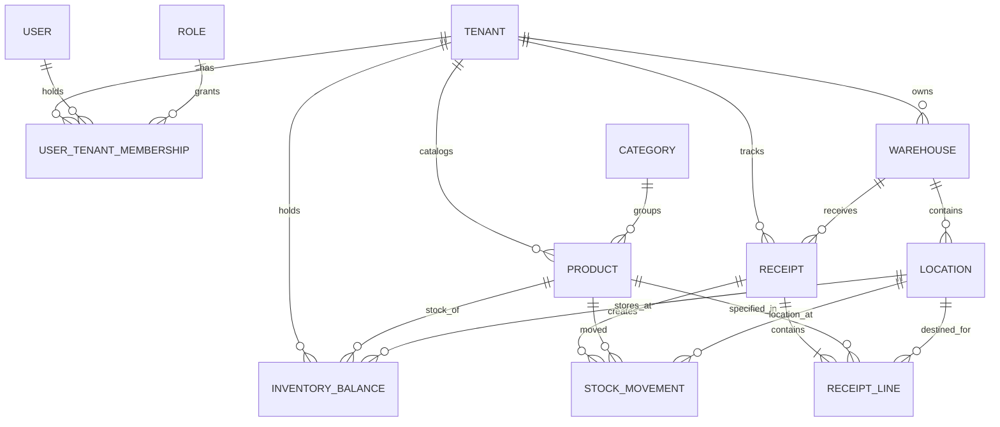

# StockSense — Enterprise Inventory & Warehouse Management Platform

[](https://github.com/amitraghvan/StockSense/actions)
[](https://www.typescriptlang.org/)
[](LICENSE)

> A modern, multi-tenant inventory management system and SaaS platform built for high-throughput multi-warehouse operations, real-time stock balances, atomic inventory operations, and audit-ready ledger tracking.

---

## 📑 Table of Contents

1. [Executive Overview](#1-executive-overview)
2. [Implemented Phases Roadmap](#2-implemented-phases-roadmap)
3. [System Architecture Blueprint](#3-system-architecture-blueprint)
4. [Domain Model & Database Design](#4-domain-model--database-design)
5. [Inbound Receipts & Stock Mutation Rules](#5-inbound-receipts--stock-mutation-rules)
6. [Multi-Tenancy & Security Architecture](#6-multi-tenancy--security-architecture)
7. [Technology Stack](#7-technology-stack)
8. [Repository Structure](#8-repository-structure)
9. [Developer Quickstart](#9-developer-quickstart)
10. [Testing & Verification](#10-testing--verification)

---

## 1. Executive Overview

StockSense is an ERP-grade inventory management platform engineered for enterprise scalability, sub-millisecond query responses, and absolute stock calculation accuracy.

Key architectural characteristics:

- **Modular Monolith**: Cleanly separated domain modules (Auth, Products, Warehouses, Receipts, Ledger) running as a unified service with zero distributed transaction fallibility.
- **Strict Multi-Tenancy**: Complete logical isolation of data, sequence counters, inventory balances, and user memberships.
- **Zero Frontend Stock Tampering**: The browser UI never modifies physical stock counts directly; all stock mutations occur via server-enforced atomic transactions upon command completion.
- **Idempotency & Concurrency Safety**: Repeated operations or race conditions are safely resolved without duplicate stock increments.

---

## 2. Implemented Phases Roadmap

- [x] **Phase 01 — Production Engineering Foundation**: NestJS 11 + Fastify API, Next.js 15 App Router web shell, PostgreSQL/Prisma connection pooling, Redis 7+ cache, Pino structured logging, correlation request IDs, and CI/CD pipelines.
- [x] **Phase 02 — Authentication, Authorization & Multi-Tenancy**: Secure Argon2 password hashing, JWT access & refresh token rotation, tenant context resolution, workspace switching, and granular RBAC permissions.
- [x] **Phase 03 — Inventory Master Data**: Product catalog with SKUs, units of measure (UOM), hierarchical categories, multi-warehouse facilities, and bin/shelf storage locations.
- [x] **Phase 04 — Receipts & Incoming Inventory Operations**: Vendor inbound shipments, concurrency-safe sequential reference generation (`WH/IN/0001`), server-side state machine (`DRAFT` → `READY` → `DONE`), atomic transactional stock balance upserts, Kanban board, and delivery dockets.
- [ ] **Phase 05 — Deliveries & Outgoing Operations** _(Upcoming)_
- [ ] **Phase 06 — Internal Warehouse Transfers** _(Upcoming)_
- [ ] **Phase 07 — Inventory Adjustments & Cycle Counts** _(Upcoming)_
- [ ] **Phase 08 — Stock Ledger & Move History Analytics** _(Upcoming)_

---

## 3. System Architecture Blueprint

StockSense uses a clean tiered architecture where HTTP transport, authentication/tenant guards, domain logic, and transactional database storage are strictly decoupled:

```
┌────────────────────────────────────────────────────────────────────────┐
│                        WEB APPLICATION SHELL                           │
│     Next.js 15 (App Router) • React 19 • Tailwind CSS • TanStack Query │
│         [List & Kanban Views]  •  [Dynamic Forms]  •  [Print Dockets]   │
└───────────────────────────────────┬────────────────────────────────────┘
                                    │ HTTP / REST / JSON
                                    ▼
┌────────────────────────────────────────────────────────────────────────┐
│                        NESTJS + FASTIFY API GATEWAY                    │
│   • Helmet & Strict CORS        • Request Correlation ID Interceptor   │
│   • Pino Structured Logger      • Global Standard Error Envelope Filter│
└───────────────────────────────────┬────────────────────────────────────┘
                                    │
                                    ▼
┌────────────────────────────────────────────────────────────────────────┐
│                    CROSS-CUTTING SECURITY & GUARDS                     │
│  JwtAuthGuard ──► TenantResolutionGuard ──► PermissionsGuard (RBAC)    │
└───────────────────────────────────┬────────────────────────────────────┘
                                    │
    ┌───────────────────────────────┴───────────────────────────────┐
    ▼                               ▼                               ▼
┌───────────────────────┐ ┌───────────────────────┐ ┌───────────────────────┐
│     AUTH & TENANTS    │ │      MASTER DATA      │ │  RECEIPTS & INVENTORY │
│ • Multi-Tenant Mgmt   │ │ • Products & SKUs     │ │ • State Machine       │
│ • Password / OTP Auth │ │ • Categories          │ │ • Sequence Generator  │
│ • Role Memberships    │ │ • Warehouses & Locs   │ │ • Atomic Stock Upsert │
└───────────┬───────────┘ └───────────┬───────────┘ └───────────┬───────────┘
            │                         │                         │
            └─────────────────────────┼─────────────────────────┘
                                      ▼
┌────────────────────────────────────────────────────────────────────────┐
│                         INFRASTRUCTURE LAYER                           │
│            Prisma ORM (Connection Pool)   •   ioredis (Cache)          │
└───────────────────┬───────────────────────────────────┬────────────────┘
                    ▼                                   ▼
         ┌─────────────────────┐             ┌─────────────────────┐
         │ PostgreSQL Database │             │     Redis Cache     │
         │  (ACID Transactions)│             │ (Session / Tokens)  │
         └─────────────────────┘             └─────────────────────┘
```

---

## 4. Domain Model & Database Design



### Key Tables & Constraints

- **`Tenant`**: Root organizational boundary.
- **`User` & `UserTenantMembership`**: Multi-workspace membership with roles (`ADMIN`, `INVENTORY_MANAGER`, `WAREHOUSE_STAFF`, `OPERATIONS_LEAD`, `AUDITOR`).
- **`Warehouse` & `Location`**: Physical multi-warehouse storage units. Location unique by `(tenantId, warehouseId, shortCode)`.
- **`Product`**: Master SKU catalog. Unique by `(tenantId, sku)`.
- **`ReceiptSequence`**: Atomic reference counter unique by `(tenantId, prefix)`.
- **`Receipt` & `ReceiptLine`**: Inbound shipment header and line items.
- **`InventoryBalance`**: Transactional on-hand stock balance. Unique by `(productId, locationId)`.
- **`StockMovement`**: Immutable transaction log for every incoming receipt or stock adjustment.

---

## 5. Inbound Receipts & Stock Mutation Rules

### The Golden Inventory Lifecycle

```
           +-------+
           | DRAFT | ──────────┐
           +-------+           │
               │               │
        validateReceipt()      │
               ↓               │
           +-------+           │
           | READY | ────┐     │ cancelReceipt()
           +-------+     │     │
               │         │     │
        completeReceipt()│     │
               ↓         │     │
           +-------+     │     │
           | DONE  |     ▼     ▼
           +-------+  +-----------+
                      | CANCELLED |
                      +-----------+
```

1. **`DRAFT`**: Intent only. Modifiable (products, quantities, locations, dates). **No stock modification.**
2. **`READY`**: Staged shipment ready to be received. **No stock modification.**
3. **`DONE`**: Physical goods received. **Atomically increments physical inventory** in `InventoryBalance` and appends a record in `StockMovement`.
4. **`CANCELLED`**: Inbound order voided. Completed (`DONE`) receipts can **never** be cancelled.

### Atomic Completion Transaction

```ts
await prisma.$transaction(async (tx) => {
  // 1. Verify receipt is READY
  // 2. Atomically upsert inventory balances
  for (const line of receipt.lines) {
    await tx.inventoryBalance.upsert({
      where: { productId_locationId: { productId: line.productId, locationId: line.locationId } },
      update: { quantityOnHand: { increment: line.quantity } },
      create: { tenantId, productId: line.productId, locationId: line.locationId, quantityOnHand: line.quantity },
    });
    // 3. Create immutable ledger movement
    await tx.stockMovement.create({ ... });
  }
  // 4. Update status to DONE
  await tx.receipt.update({ where: { id }, data: { status: 'DONE', completedAt: new Date() } });
});
```

---

## 6. Multi-Tenancy & Security Architecture

- **Tenant Isolation**: Every database query includes `where: { tenantId }`. No tenant can read or infer another tenant's data.
- **Sequential Reference Safety**: References are generated via database sequence rows (`WH/IN/0001`), eliminating race conditions and avoiding `MAX(id) + 1` concurrency bugs.
- **Authentication**: Argon2 password hashing with custom salt, JWT access tokens (15m), and refresh token rotation with family revocation detection.
- **Role-Based Access Control**:
  - `receipt:view` → View and search receipts.
  - `receipt:create` → Create and update draft receipts.
  - `receipt:validate` → Validate (`READY`), Complete (`DONE`), and Cancel receipts.

---

## 7. Technology Stack

| Tier                      | Technologies                                                              |
| ------------------------- | ------------------------------------------------------------------------- |
| **Frontend**              | Next.js 15 (App Router), React 19, TypeScript, Tailwind CSS, Lucide Icons |
| **State & Data Fetching** | TanStack Query v5, Axios / Typed API Client                               |
| **Backend Engine**        | NestJS 11, Fastify Adapter, OpenAPI 3.0 / Swagger                         |
| **Database & ORM**        | PostgreSQL 14+, Prisma ORM 6                                              |
| **Cache & Session**       | Redis 7+, `ioredis`                                                       |
| **Security & Auth**       | Argon2, JWT, Helmet, Fastify Cookie, Zod runtime validation               |
| **Testing**               | Jest, Supertest, Playwright E2E                                           |
| **Tooling**               | Turborepo / pnpm workspaces, ESLint, Prettier, Husky                      |

---

## 8. Repository Structure

```
stocksense/
├── apps/
│   ├── api/                       # NestJS + Fastify REST Backend
│   │   ├── prisma/                # Schema, migrations & seed scripts
│   │   ├── src/
│   │   │   ├── modules/           # Auth, Products, Warehouses, Receipts, Audit
│   │   │   ├── infrastructure/    # Prisma database, Redis, Pino logging
│   │   │   └── common/            # Guards, interceptors, error filters
│   │   └── test/                  # Supertest e2e test suites
│   │
│   └── web/                       # Next.js 15 App Router Frontend
│       ├── e2e/                   # Playwright smoke test suites
│       └── src/
│           ├── app/               # Routes: /operations/receipts, /products, /settings
│           ├── components/        # ERP Layout, Header, StatusBadges, Dialogs
│           └── hooks/             # TanStack Query custom data hooks
│
├── packages/
│   ├── types/                     # Shared TypeScript data contracts & models
│   ├── validation/                # Shared Zod validation schemas
│   └── ui/                        # Reusable design system primitives
│
└── docs/                          # Comprehensive architectural specifications
    ├── ARCHITECTURE.md            # In-depth architectural blueprint
    ├── RECEIPTS.md                # Phase 04 receipts & inventory guide
    ├── PHASE-04-REPORT.md         # Phase 04 22-point audit & sign-off report
    └── MULTI-TENANCY.md           # Multi-tenancy isolation model
```

---

## 9. Developer Quickstart

### Prerequisites

- Node.js 20+ LTS
- pnpm 10+ (`corepack enable pnpm`)
- PostgreSQL 14+ running locally or in Docker
- Redis 7+ running locally or in Docker

### 1. Clone & Install Dependencies

```bash
git clone https://github.com/amitraghvan/StockSense.git
cd StockSense
pnpm install
```

### 2. Configure Environment

```bash
cp .env.example .env
```

Ensure `DATABASE_URL` and `REDIS_URL` point to your running instances.

### 3. Run Database Migrations & Seed Data

```bash
pnpm --filter @stocksense/api prisma:migrate:deploy
pnpm --filter @stocksense/api prisma:seed
```

### 4. Start Development Servers

```bash
# Starts both Next.js (port 3000) and NestJS Fastify API (port 4000):
pnpm dev
```

### 5. Access the Application

- **Web App**: [http://localhost:3000](http://localhost:3000)
- **API Swagger Documentation**: [http://localhost:4000/docs](http://localhost:4000/docs)
- **Default Admin Login**: `admin@stocksense.dev` / `Admin123!@#`

---

## 10. Testing & Verification

```bash
# Run all unit tests
pnpm test:unit

# Run full API integration and E2E suites (Receipts, Auth, Multi-Tenancy)
pnpm --filter @stocksense/api test:integration

# Run Playwright Web browser smoke tests
pnpm --filter @stocksense/web test

# Run TypeScript compiler checks across all packages
pnpm -r typecheck

# Run ESLint across monorepo
pnpm -r lint

# Production build verification
pnpm -r build
```

---

## License

This project is licensed under the MIT License - see the [LICENSE](LICENSE) file for details.
