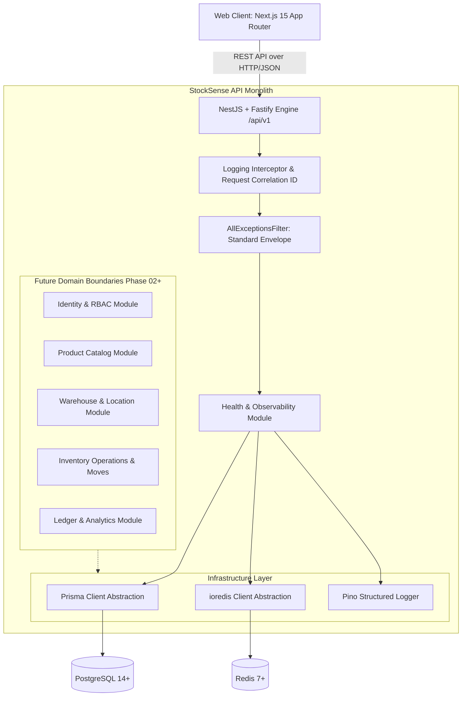

# StockSense — System Architecture Blueprint

**Phase 01: Production Engineering Foundation**  
**Pattern:** Modular Monolith  
**Primary Goal:** Resilient, scalable, and type-safe inventory management platform baseline.

---

## 1. System Topology Overview

StockSense is structured as an enterprise-grade modular monolith. It provides clean internal boundaries between domains, centralized cross-cutting concerns (logging, security, tracing), and direct connection pooling to PostgreSQL and Redis.

---

## 2. Why a Modular Monolith? (Not Microservices)

### 2.1 The Case Against Premature Microservices

1. **Network Overhead & Distributed Fallibility**: Microservices introduce latency, serialization overhead, network partitions, and dual-write consistency problems. At early stages, distributed systems slow down team velocity without providing business leverage.
2. **Transaction Boundaries**: Inventory management fundamentally requires strict ACID guarantees (e.g., decrements, receipts, and balance calculations). PostgreSQL handles transaction rollbacks seamlessly within a single database.
3. **Operational Complexity**: Independent deployments require service meshes, distributed tracing collectors, container orchestrators (Kubernetes), and complex CI/CD matrices.

### 2.2 Preserving Future Service Extraction

StockSense enforces strict module isolation:

- Domain services never directly query other module tables.
- Cross-module communication occurs via defined interfaces and DTOs.
- Database access is encapsulated inside infrastructure services.
- When scale demands horizontal extraction (e.g. separating High-Throughput Analytics or Notifications), the module can be lifted into an independent microservice with minimal code refactoring.

---

## 3. Technology Stack Reference

| Tier                 | Technology                                       | Purpose                                                                |
| :------------------- | :----------------------------------------------- | :--------------------------------------------------------------------- |
| **Frontend Shell**   | Next.js 15 (App Router), React 19, TypeScript    | Server Components, SEO optimization, high-performance static rendering |
| **Design System**    | Tailwind CSS, shadcn/ui primitives, Lucide Icons | Accessible, high-end B2B SaaS aesthetic, theme toggle support          |
| **Data Fetching**    | TanStack Query v5                                | Client-side caching, auto-refetch, offline resilience                  |
| **Backend Engine**   | NestJS 11 + Fastify adapter                      | Low latency, high throughput, structured Dependency Injection          |
| **Documentation**    | OpenAPI 3.0 / Swagger UI (`/docs`)               | Self-documenting API contracts, schema inspection                      |
| **Database & ORM**   | PostgreSQL 14+, Prisma ORM                       | Declarative schema, type-safe query generation, migration history      |
| **Cache & State**    | Redis 7+ via `ioredis`                           | Sub-millisecond ping probes, future distributed locking & caching      |
| **Logging**          | Pino                                             | Low-overhead JSON structured logging, correlation ID tracing           |
| **Monorepo Manager** | pnpm 10 workspaces                               | Strict dependency graph, isolated packages, zero phantom imports       |

---

## 4. Architectural Rules & Invariants

1. **Rule 1 — Single Responsibility Controllers**: Controllers handle HTTP mapping, route parameters, status codes, and DTO piping only. No business logic in controllers.
2. **Rule 2 — Domain Logic Isolation**: Domain operations reside strictly within service classes.
3. **Rule 3 — Infrastructure Encapsulation**: PostgreSQL and Redis access resides exclusively in `apps/api/src/infrastructure/`.
4. **Rule 4 — Standard Response Envelopes**: All API responses follow standard formats:
   - Success: `{ success: true, data: T, meta: { requestId, timestamp } }`
   - Failure: `{ success: false, error: { code, message, details, requestId, timestamp } }`
5. **Rule 5 — Fail-Fast Configuration**: If required environment variables are invalid or absent, the process throws immediately at startup.
6. **Rule 6 — Zero Leaks in Production**: Internal database error details and stack traces are stripped before sending HTTP responses in production mode.
7. **Rule 7 — Phase Boundary Integrity**: Business modules (Products, SKUs, Warehouses, Receipts, Deliveries, Adjustments) are strictly prohibited in Phase 01.
