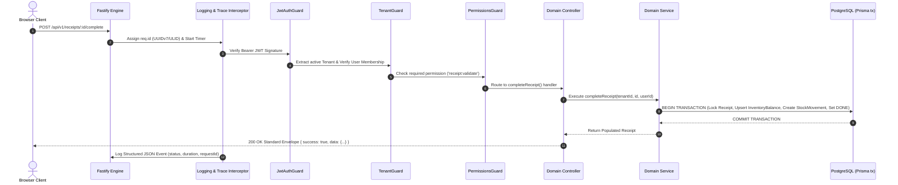

# StockSense — Enterprise System Architecture Blueprint

**Version:** 4.0.0 (Phase 04 Verified)  
**Architectural Style:** Modular Monolith with Tiered Multi-Tenancy  
**Primary Engine:** NestJS 11 + Fastify Adapter & Next.js 15 App Router

---

## 1. Executive Architecture Summary

StockSense is an enterprise-grade inventory and warehouse operations system. Its core design philosophy centers on **absolute data consistency, zero distributed transaction overhead, strict tenant isolation, and atomic inventory mutations**.

```
┌────────────────────────────────────────────────────────────────────────┐
│                        WEB APPLICATION SHELL                           │
│     Next.js 15 (App Router) • React 19 • Tailwind CSS • TanStack Query │
│         [List & Kanban Views]  •  [Dynamic Forms]  •  [Print Dockets]   │
└───────────────────────────────────┬────────────────────────────────────┘
                                    │ HTTP / REST / JSON
                                    ▼
┌────────────────────────────────────────────────────────────────────────┐
│                        NESTJS + FASTIFY API GATEWAY                    │
│   • Helmet & Strict CORS        • Request Correlation ID Interceptor   │
│   • Pino Structured Logger      • Global Standard Error Envelope Filter│
└───────────────────────────────────┬────────────────────────────────────┘
                                    │
                                    ▼
┌────────────────────────────────────────────────────────────────────────┐
│                    CROSS-CUTTING SECURITY & GUARDS                     │
│  JwtAuthGuard ──► TenantResolutionGuard ──► PermissionsGuard (RBAC)    │
└───────────────────────────────────┬────────────────────────────────────┘
                                    │
    ┌───────────────────────────────┴───────────────────────────────┐
    ▼                               ▼                               ▼
┌───────────────────────┐ ┌───────────────────────┐ ┌───────────────────────┐
│     AUTH & TENANTS    │ │      MASTER DATA      │ │  RECEIPTS & INVENTORY │
│ • Multi-Tenant Mgmt   │ │ • Products & SKUs     │ │ • State Machine       │
│ • Password / OTP Auth │ │ • Categories          │ │ • Sequence Generator  │
│ • Role Memberships    │ │ • Warehouses & Locs   │ │ • Atomic Stock Upsert │
└───────────┬───────────┘ └───────────┬───────────┘ └───────────┬───────────┘
            │                         │                         │
            └─────────────────────────┼─────────────────────────┘
                                      ▼
┌────────────────────────────────────────────────────────────────────────┐
│                         INFRASTRUCTURE LAYER                           │
│            Prisma ORM (Connection Pool)   •   ioredis (Cache)          │
└───────────────────┬───────────────────────────────────┬────────────────┘
                    ▼                                   ▼
         ┌─────────────────────┐             ┌─────────────────────┐
         │ PostgreSQL Database │             │     Redis Cache     │
         │  (ACID Transactions)│             │ (Session / Tokens)  │
         └─────────────────────┘             └─────────────────────┘
```

---

## 2. Why a Modular Monolith?

### 2.1 The Case Against Premature Microservices in Inventory Management

1. **ACID Guarantees vs. Distributed Two-Phase Commits**: Inventory transactions require atomicity. When an incoming receipt completes, inventory balances across multiple product/location pairs must increment simultaneously. In microservices, this requires Saga orchestration or distributed locks, creating massive points of failure and network partition vulnerabilities.
2. **Sub-Millisecond Query Performance**: In StockSense, querying receipts along with their line items, product SKUs, warehouse codes, and location identifiers takes **less than 10ms** using optimized PostgreSQL joins. Microservices would require multiple network hops and API aggregation.
3. **Operational Overhead**: Eliminates service meshes, Kubernetes ingress complexity, distributed tracing collectors, and inter-service authentication overhead.

### 2.2 Preserving Future Service Extraction

StockSense enforces strict module isolation:

- Domain modules (Auth, Products, Warehouses, Receipts) communicate only through exported services and typed contracts.
- Direct foreign schema manipulation across module boundaries is prohibited.
- If future workload demands separate microservices (e.g., extracting an asynchronous reporting or IoT sensor processing service), the module boundary is already defined and can be cleanly decoupled.

---

## 3. Request Lifecycle & Pipeline Architecture

Every incoming HTTP request traverses an invariant security and observability pipeline:



---

## 4. Inbound Inventory & Stock Mutation Rules

### 4.1 State Machine

The system strictly enforces the four-state receipt lifecycle:

- **`DRAFT`**: Initial creation state. Products, quantities, target warehouse, and locations are editable. **Zero stock balance impact.**
- **`READY`**: Validated state. Warehouse is ready to receive goods. **Zero stock balance impact.**
- **`DONE`**: Terminal completion state. **Atomically increments physical stock** in `InventoryBalance` and appends an immutable `StockMovement` ledger entry.
- **`CANCELLED`**: Cancelled state. Terminal. Completed receipts can **never** be cancelled.

### 4.2 Idempotency & Concurrency Strategy

- **Sequential Reference Counter**: Generated server-side using PostgreSQL atomic sequence table `ReceiptSequence` with a unique constraint on `(tenantId, prefix)`. Avoids concurrency race conditions inherent to `SELECT MAX(ref)`.
- **Idempotent Completion**: If duplicate `POST /complete` calls arrive concurrently or sequentially, the service verifies `if (receipt.status === 'DONE') return this.findOne(tenantId, id);` without performing duplicate stock increments.

---

## 5. Multi-Tenancy Isolation Blueprint

StockSense implements **Logical Row-Level Multi-Tenancy**:

1. **Tenant Scoping**: All operational tables (`receipts`, `receipt_lines`, `inventory_balances`, `products`, `warehouses`, `locations`) include `tenantId`.
2. **Context Resolution**: The `TenantGuard` verifies that the authenticated user belongs to the requested workspace.
3. **Foreign Key Integrity**: Locations and products in receipt lines are strictly validated to belong to the active `tenantId` and the selected `warehouseId`.

---

## 6. Performance & Database Indexing

Targeted indexing ensures queries execute in under 15ms under high concurrent load:

- `Receipt`: `(tenantId, status)`, `(tenantId, reference)`, `(tenantId, scheduleDate)`
- `ReceiptLine`: `(receiptId)`, `(productId)`, `(locationId)`
- `InventoryBalance`: Unique `(productId, locationId)`, Index `(tenantId, productId)`
- `StockMovement`: `(tenantId, receiptId)`, `(productId, locationId)`

All endpoints enforce server-side pagination with whitelisted sort fields to prevent unbounded memory consumption and SQL injection.
